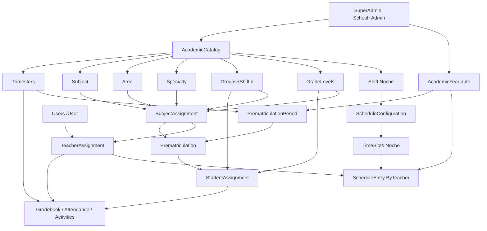

# Análisis Técnico Completo — Eduplaner Nocturna

**Proyecto:** `C:\Proyectos\EduplanerNoche\SchoolManager`  
**Producto:** SchoolManager / Eduplaner Nocturna (fork orientado a jornada nocturna CELOSAM)  
**Stack:** ASP.NET Core 8 MVC · EF Core 9 · PostgreSQL (Npgsql) · Cookie Auth · AdminLTE  
**Fecha del análisis:** 15 de julio de 2026  
**Alcance:** Inventario funcional real basado en código (Controllers, Services, Models, Views, Menús, Config).  
**Regla:** Este documento **no inventa** pantallas ni procesos. Lo marcado como *INEXISTENTE*, *PARCIAL* o *OCULTO EN MENÚ* está verificado en código.

---

## 1. Resumen ejecutivo del producto

Eduplaner Nocturna es el mismo codebase SchoolManager con:

1. **Jornada forzada a Noche** en configuración de horarios (`ScheduleConfigurationController`: “opera solo jornada nocturna”).
2. **EnrollmentType por defecto = `Nocturno`** (`Helpers/EnrollmentTypeConstants.cs`, `StudentAssignment`).
3. **Feature flags nocturnos** en `appsettings.json`:
   - `NocturnalAdvancedEnrollment.EnableForAllSchools = true`
   - `NocturnalModularEnrollment.Enabled = true`
4. **Módulos CELOSAM** (malla curricular, prerrequisitos, créditos/convalidaciones, documentos, reportes).
5. Prematrícula filtrada a grados/grupos con jornada **Noche**.

**No es un producto separado.** Comparte controladores y tablas con Eduplaner “tradicional”, con divergencias de UX y defaults hacia nocturna.

### Inventario cuantitativo (julio 2026)

| Artefacto | Cantidad |
|-----------|----------|
| Controllers (incluye Admin/Api) | 60 |
| Services/Implementations | 82 |
| Models | 63 |
| Carpetas Views | 54 |

---

## 2. Arquitectura

### 2.1 Capas

| Capa | Ubicación | Observación |
|------|-----------|-------------|
| Presentación | `Controllers/`, `Views/` | MVC + AJAX JSON en el mismo controlador |
| Aplicación | `Services/Interfaces`, `Services/Implementations` | DI Scoped en `Program.cs` |
| Dominio/Datos | `Models/`, `SchoolDbContext` | Sin ensamblados Domain/Application separados |
| Persistencia | PostgreSQL + EF Migrations | Multi-tenant por `SchoolId` |
| Cross-cutting | `Filters/`, `Middleware/`, `Helpers/`, `Options/` | Auth, tenant, fechas, menús |

### 2.2 Autenticación y políticas

- Cookie authentication.
- Roles como **string** en `users.role` (no tabla `roles`).
- Policies en `Program.cs`: SuperAdmin, Admin, Teacher, Student, Parent/Acudiente, Contabilidad.

### 2.3 Roles verificados en código

**CHECK BD / EnsureUsersRoleCheck:**  
`superadmin`, `admin`, `director`, `teacher`, `parent`, `student`, `estudiante`, `acudiente`, `contable`, `contabilidad`, `secretaria`, `clubparentsadmin`, `qlservices`, `inspector`

**UserController allow-list (creación por admin):**  
`director`, `teacher`, `contable`, `secretaria`, `estudiante`, `acudiente`, `contabilidad`, `parent`, `clubparentsadmin`, `qlservices`, `inspector`  
(+ `admin` en UpdateJson).

**Aliases usados en Authorize:** `docente`, `profesor` (parcial).

---

## 3. Multi-tenant e institución

| Entidad | Ruta | Dependencias | Estado |
|---------|------|--------------|--------|
| School | `/SuperAdmin/CreateSchoolWithAdmin` | SuperAdmin | COMPLETO |
| Admin ligado a escuela | Creado junto a School | School | COMPLETO |
| AcademicYear por defecto | **Sin UI Index** — `AcademicYearService.EnsureDefaultAcademicYearForSchoolAsync` | School | COMPLETO (auto) |
| SchoolController CRUD | `/School/*` | Role `admin` | COMPLETO |

**Hallazgo crítico:** No existe `/AcademicYear/Index`. El año se crea al bootstrap de escuela o vía utilidades (`/Prematriculation/ApplyAcademicYearChangesPage`).

---

## 4. Orden REAL de configuración inicial (dependencias de código)

```
0. SuperAdmin crea School + Admin
1. AcademicYear (automático / asegurar activo)
2. Shift "Noche"  (/AcademicCatalog → Jornadas)
3. GradeLevels, Groups (con ShiftId=Noche), Specialties, Areas, Subjects
4. Trimesters (/AcademicCatalog → Trimestres)
5. SubjectAssignment (impartición: Especialidad+Área+Materia+Grado+Grupo)
6. Users: teachers, estudiantes, acudientes (/User/Index)
7. TeacherAssignment (/TeacherAssignment/Index)
8. ScheduleConfiguration → genera TimeSlots Noche
9. TimeSlot ajuste fino (/TimeSlot/Manage)
10. ScheduleEntry (/Schedule/ByTeacher)
11. PrematriculationPeriod (/PrematriculationPeriod) [controlador existe; menú admin parcialmente comentado]
12. Prematriculación → Pago → ConfirmMatriculation → StudentAssignment
    — O — StudentAssignment directo (/StudentAssignment/Index)
13. Activities / TeacherGradebook / Attendance / Reportes / Portales
```

### Justificación (evidencia)

- `SubjectAssignment` exige 5 FK obligatorias.
- `ScheduleService.CreateEntryAsync` exige TeacherAssignment + TimeSlot + AcademicYear; valida conflictos docente y grupo.
- Prematrícula nocturna solo ofrece grados con SubjectAssignment en grupos Noche.
- Guardar notas exige StudentAssignment activa.
- Activities exige trimestre activo.

---

## 5. Catálogo académico

### 5.1 Pantalla unificada

**Ruta:** `/AcademicCatalog/Index`  
**Roles menú:** `admin`  
**Authorize controller:** `admin,secretaria,director`

**Pestañas reales (Views/AcademicCatalog/Index.cshtml):**

1. Grados (`#grades`)
2. Grupos (`#groups`)
3. Jornadas (`#shifts`)
4. Materias (`#subjects`)
5. Áreas (`#areas`)
6. Especialidades (`#specialties`)
7. Trimestres (`#trimesters`) — incluye “Configuración del Año Escolar y Trimestres”

**Carga masiva:** `/AcademicCatalog/Upload` → `SaveCatalog` (fuerza Shift Noche en grupos en flujo nocturno).

### 5.2 Trimestres — detalle

| Acción | Ruta |
|--------|------|
| Guardar configuración | `POST /AcademicCatalog/GuardarTrimestres` |
| Activar | `POST /AcademicCatalog/ActivarTrimestre` |
| Desactivar | `POST /AcademicCatalog/DesactivarTrimestre` |
| Editar fechas | modal + endpoint Editar |
| Eliminar todos | `EliminarTodosLosTrimestres` |

**Campos UI:** `anioEscolar`, `cantidadTrimestres` (2|3|4); fechas `inicio{N}T` / `fin{N}T`; activación individual.

**Activar/Desactivar:** `TrimesterService.ActivarTrimestreAsync` pone `IsActive=true` pero **no desactiva automáticamente** los demás trimestres (pueden coexistir varios activos). PARCIAL / riesgo operativo.

**Hallazgo:** `Trimester.AcademicYearId` existe en modelo pero `GuardarTrimestres` **no siempre lo setea** (relación soft por fechas/escuela). PARCIAL.

### 5.3 Jornada

| Acción | Ruta |
|--------|------|
| Crear shift | `POST /AcademicCatalog/CreateShift` |
| Contar grupos | `GetShiftGroupsCount` |

**Nombre canónico nocturno:** `"Noche"`.

### 5.4 Group

Modelo: `SchoolId`, `Name`, `MaxCapacity`, `Shift` (legacy string) + `ShiftId` FK.  
Para nocturna: **ShiftId debe apuntar a Noche**.

---

## 6. Asignaciones

### 6.1 SubjectAssignment (catálogo de impartición)

**Ruta:** `/SubjectAssignment/Index`  
**FK:** SpecialtyId, AreaId, SubjectId, GradeLevelId, GroupId (+ SchoolId)  
**Estado:** COMPLETO  
Sin SubjectAssignment no hay TeacherAssignment ni oferta de prematriculación nocturna.

### 6.2 TeacherAssignment

**Rutas:** `/TeacherAssignment/Index`, carga `/AcademicAssignment/Upload`  
**Modelo:** TeacherId + SubjectAssignmentId (único).  
**Desbloquea:** ScheduleEntry, Gradebook, planes de trabajo.

### 6.3 StudentAssignment (matrícula operativa)

**Rutas:** `/StudentAssignment/Index`, `/StudentAssignment/Upload`  
**Modelo:** Student + Grade + Group + AcademicYearId + ShiftId + EnrollmentType (`Nocturno` default).  
**No existe** tabla/modelo llamado `Matricula`; la matrícula **es** StudentAssignment (+ SSA modulares).

### 6.4 SSA / modular

`StudentSubjectAssignment`, CurriculumTrack, CurriculumSubject, Prerequisites — habilitados por `NocturnalModularEnrollment`.  
UI: `/Prematriculation/ModularSubjects`, `/SuperAdmin/CurriculumTracks`, `/Celosan/BulkCredits`, `/SuperAdmin/Equivalencies`.

---

## 7. Prematrícula y matrícula

| Componente | Ruta | Roles | Estado |
|------------|------|-------|--------|
| Período | `/PrematriculationPeriod/Index|Create` | admin,superadmin | COMPLETO; menú admin en layout a veces comentado |
| Crear prematrícula | `/Prematriculation/Create` | acudiente, parent, student, estudiante | COMPLETO |
| Mis prematrículas | `/Prematriculation/MyPrematriculations` | mismos | COMPLETO |
| Confirmar matrícula | `/Prematriculation/ConfirmMatriculation` | admin/flujo pago | COMPLETO |
| Selección modular | `/Prematriculation/ModularSubjects` | student | COMPLETO (nocturna modular) |
| Admin listado | `/Prematriculation/Index` | staff | COMPLETO |

**Dependencias período:** fechas, MaxCapacityPerGroup, AutoAssignByShift, AcademicYearId, TrimesterId, MaxSubjectsAllowed.

**Flujo documentado en código/docs:** Prematriculado → Pagado → Matriculado → crea StudentAssignment.

---

## 8. Horarios (análisis profundo)

### 8.1 Configuración de jornada

**Ruta:** `/ScheduleConfiguration/Index`  
**Roles:** admin, director  
**UI:** solo campos Noche (inicio, duración min, cantidad bloques, recreo).  
**Comportamiento al guardar:** elimina time slots previos de la escuela (si force/condiciones), crea Shift Noche si falta, genera `Bloque N` (+ recreo opcional) con `ShiftId = Noche`.  
Mañana/Tarde: enviados como hidden/compatibilidad — **ignorados en lógica nocturna**.

### 8.2 Bloques (TimeSlot)

| Ruta | Uso |
|------|-----|
| `/TimeSlot/Manage` | Ajuste principal (menú) |
| `/TimeSlot/Index` | Listado/CRUD (+ Eliminar todos) |
| DeleteAll | Requiere confirmar `ELIMINAR`; borra schedule_entries luego time_slots |

**Campos:** Name, StartTime, EndTime, DisplayOrder, IsActive, ShiftId, SchoolId.

### 8.3 Carga por docente

**Ruta:** `/Schedule/ByTeacher`  
**Roles:** admin, director, teacher  
**Flujo:**
1. Seleccionar docente (admin/director) + año académico.
2. Cargar tabla semanal.
3. Celda → elegir TeacherAssignment (materia-grupo).
4. `POST /Schedule/SaveEntry`.

**Validaciones (`ScheduleService`):**
- DayOfWeek 1–7.
- Docente no puede traslapar horas el mismo día.
- Grupo no puede traslapar horas el mismo día.
- Teacher solo edita sus propias asignaciones.

**Lectura estudiante:** `/StudentSchedule/MySchedule` (solo lectura).  
**Importador Excel nativo de horarios:** INEXISTENTE (existió script ad-hoc `Scripts/import_quena_schedules.py`).

### 8.4 Salones / Room

`ScheduleEntry` diseño mencionó RoomId futuro; en modelo actual **no hay gestión de salones operativa completa** → documentar como **NO IMPLEMENTADO / FASE POSTERIOR**.

---

## 9. Usuarios, profesores, estudiantes, acudientes

| Función | Ruta | Notas |
|---------|------|-------|
| CRUD usuarios | `/User/Index` | SchoolId forzado al del admin |
| Docentes | Role `teacher` | Luego TeacherAssignment |
| Estudiantes | Role `estudiante`/`student` | Luego StudentAssignment |
| Acudientes | `acudiente`/`parent` | Link Prematriculation.ParentId y/o Students.ParentId |
| Perfil institucional staff | `/StaffInstitutionalProfile` | Complementario |
| Cambio password | `/ChangePassword/Index` | Todos autenticados |
| Reset admin | `/Admin/UserPasswordManagement` | Admin |

**Retiro / reingreso / cambio de grado:** vía StudentAssignment (UpdateGroupAndGrade, Add/RemoveEnrollment) y SubjectPromotion / SubjectWithdrawalRequests. No hay wizard único llamado “Retiro” con todos los estados legales — **PARCIAL / distribuido**.

---

## 10. Evaluación, asistencia, actividades

| Módulo | Ruta | Roles | Dependencias |
|--------|------|-------|--------------|
| Activity | `/Activity/*` | admin,teacher,docente,director | Trimestre activo |
| TeacherGradebook | `/TeacherGradebook/Index` | teacher | TA + StudentAssignment + Activity |
| Attendance | `/Attendance/Index` | admin,secretaria,teacher,docente,director | StudentAssignment |
| Orientation / Discipline | respectivos controllers | staff | Parciales |
| Aprobados/Reprobados | `/AprobadosReprobados/Index` | admin,director,teacher | Notas |
| Work Plans | `/TeacherWorkPlan`, `/DirectorWorkPlans` | teacher/admin/director | Parcial operativo |

**Escala de calificaciones:** usada en gradebook (regla típica reprobado &lt; 3.0 en docs de prematrícula). Validar en servicio de promedio; no hay pantalla “Escala” dedicada aislada → **PARCIAL** (lógica embebida).

---

## 11. Reportes, carnets, CELOSAM, pagos

| Módulo | Ruta | Estado |
|--------|------|--------|
| StudentReport | `/StudentReport` | COMPLETO (estudiante) |
| Celosan Documents/Credits/Reports | `/Celosan/*` | COMPLETO |
| Equivalencies | `/SuperAdmin/Equivalencies` | COMPLETO |
| CurriculumTracks | `/SuperAdmin/CurriculumTracks` | COMPLETO |
| StudentIdCard | `/StudentIdCard/ui` | COMPLETO |
| Payment | `/Payment/*`, `/PaymentConcept` | COMPLETO |
| Messaging | `/Messaging/*` | COMPLETO |
| ClubParents | `/ClubParents/Students` | COMPLETO (rol dedicado) |

---

## 12. Menús — fuentes de verdad

1. **`MenuService.cs`** — menú para layout `_Menu`.  
2. **`_AdminLayout.cshtml`** — sidebar más completo por rol (incluye Prematrícula admin, Pagos, Reportes CELOSAM, Horarios, etc.).

Algunas entradas de Prematrícula Period pueden estar comentadas en el layout: **verificar ambiente**. Controllers permanecen accesibles por URL directa si Authorize lo permite.

---

## 13. Diferencias vs Eduplaner tradicional

| Tema | Tradicional (histórico) | Nocturna (este fork) |
|------|-------------------------|----------------------|
| Jornadas horarias | Mañana/Tarde/Noche | Solo Noche al generar bloques |
| EnrollmentType default | Regular | Nocturno |
| Prematrícula grados | Todos | Filtra oferta Noche |
| Malla modular | Opcional | Enabled por config |
| Defaults ScheduleConfiguration | Morning-centric bootstrap | UI solo Night 18:00 / 45min / 6 bloques |
| Scripts jornadas | Varios | `Noche` canónico |

---

## 14. Funcionalidades inexistentes o incompletas (honestidad)

| Ítem | Estado | Evidencia |
|------|--------|-----------|
| UI Index Año Académico | INEXISTENTE | Solo service bootstrap |
| Importador horarios Word/Excel nativo | INEXISTENTE | Scripts externos |
| Gestión de salones (Room) en horario | NO OPERATIVA | Diseño diferido |
| Escala de notas como módulo dedicado | PARCIAL | Lógica en gradebook |
| Retiro/reingreso unificado wizard | PARCIAL | Acciones dispersas |
| Menú PrematriculationPeriod siempre visible | PARCIAL | Layout puede ocultarlo |
| GuardarTrimestres → AcademicYearId | PARCIAL | FK soft |
| TimeSlot Create / bootstrap `EnsureDefaultTimeSlots` | LEGACY | Si la escuela no tiene slots: crea **8 bloques 07:00–13:00 × 45 min** (no Noche). Debe regenerarse con `/ScheduleConfiguration` |
| Activar trimestre | PARCIAL | No desactiva los demás al activar uno |

---

## 15. Diagrama de dependencias (configuración)



---

## 16. Matrices resumidas

### 16.1 Roles × Configuración inicial

| Módulo | superadmin | admin | director | secretaria | teacher | student | acudiente |
|--------|:----------:|:-----:|:--------:|:----------:|:-------:|:-------:|:---------:|
| Create School | ✓ | | | | | | |
| AcademicCatalog | | ✓ | ✓ | ✓ | | | |
| SubjectAssignment | | ✓ | | | | | |
| TeacherAssignment | | ✓ | | | | | |
| StudentAssignment | | ✓ | ✓ | ✓* | | | |
| ScheduleConfig / TimeSlot | | ✓ | ✓ | | | | |
| ByTeacher | | ✓ | ✓ | | ✓ | | |
| PrematriculationPeriod | ✓ | ✓ | | | | | |
| Create Prematriculation | | | | | | ✓ | ✓ |
| Gradebook | | | | | ✓ | | |
| Attendance | | ✓ | ✓ | ✓ | ✓ | | |

\* Según Authorize de cada acción.

### 16.2 Prerrequisitos mínimos para “escuela operativa nocturna”

1. School + Admin  
2. AcademicYear activo  
3. Shift Noche  
4. Al menos 1 GradeLevel, 1 Group nocturno, Specialty, Area, Subject  
5. SubjectAssignments  
6. Teacher users + TeacherAssignments  
7. TimeSlots Noche  
8. ScheduleEntries (recomendado)  
9. Student users + StudentAssignments (o flujo prematriculación)  
10. Trimesters activos (para evaluación)  

---

## 17. Fuentes consultadas (no exhaustivo)

- `Program.cs`, `appsettings.json`
- `Services/Implementations/MenuService.cs`
- `Views/Shared/_AdminLayout.cshtml`
- Controllers: AcademicCatalog, Schedule*, TimeSlot, User, Prematriculation*, StudentAssignment, TeacherAssignment, Attendance, Activity, SuperAdmin, Celosan*
- Models: School, AcademicYear, Trimester, Shift, Group, SubjectAssignment, TeacherAssignment, StudentAssignment, ScheduleEntry, TimeSlot, Prematriculation*
- Docs: `FLUJO_MATRICULA_PREMATRICULA.md`, `Docs/DISENO_MODULO_HORARIOS.md`, informes nocturna/QUENA
- Scripts: `EnsureUsersRoleCheck`, `import_quena_schedules.py`

---

## 18. Conclusión del análisis

Eduplaner Nocturna está **listo para implementación institucional** si se respeta el orden de dependencias del §4. El mayor riesgo operativo histórico es:

1. Años académicos duplicados.  
2. Grupos sin Shift Noche.  
3. Intentos de horario sin TeacherAssignment.  
4. Confusión Mañana/Tarde residual en TimeSlots bootstrap.  
5. Prematrícula sin período activo o sin SubjectAssignments nocturnos.

Este análisis es la base del **Manual Premium de Configuración Inicial**.

---

## Anexo — Validacion instalacion limpia local (2026-07-15 19:06)

### Fixes de migracion aplicados

1. `Migrations/20260216194827_AddScheduleModule.cs`: crea `shifts` con `IF NOT EXISTS` antes de `time_slots`.
2. `Migrations/20251115111847_CompletePrematriculationModule.cs`: ya no asume schema legacy; crea `shifts` + columnas `shift_id` en `student_assignments` y `groups` de forma idempotente.

### Evidencia operativa

- BD: `eduplaner_nocturna_local`, 38 migraciones.
- App: `http://localhost:5172`.
- Escuela prueba + jornada Noche + 7 bloques nocturnos + 1 schedule_entry + 1 student_assignment.

### Hallazgo de producto relevante

`StudentAssignment` (matrícula) **no** materializa automaticamente `student_subject_assignments`. El libro de calificaciones avanzado / modular espera SSA.

Ver tambien: `INFORME_VALIDACION_FINAL_LOCAL.md` y matrices XLSX en esta carpeta.
