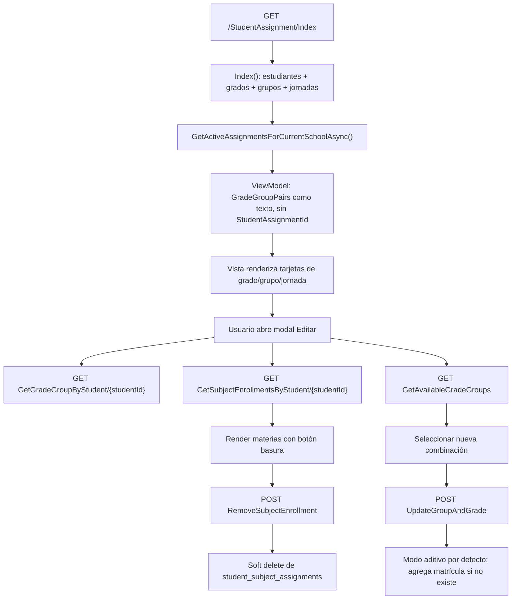

# ANÁLISIS FORENSE - StudentAssignment / Eliminación de grupos

Fecha: 2026-06-17  
Alcance: `/StudentAssignment/Index`  
Modo: solo lectura de código y PostgreSQL producción. No se ejecutaron `UPDATE`, `DELETE`, `INSERT`, migraciones, commits ni push.

## 1. Diagnóstico ejecutivo

El módulo permite agregar matrículas/grupos y remover materias individuales, pero no expone una acción visible ni un endpoint conectado para quitar una matrícula/grupo específico desde el modal de edición.

La relación estudiante-grupo vive en `student_assignments`. La eliminación funcional está modelada como soft delete (`is_active = false`, `end_date = now()`), no como borrado físico. Existe un método backend capaz de inactivar una matrícula específica (`RemoveAssignmentsAsync(studentId, onlyAssignmentId)`), pero no existe acción HTTP dedicada ni el modal recibe el `student_assignment_id`.

En el caso de Diamaris Hinkson (`8-1069-2218@celosam.com`), producción confirma tres matrículas activas: `10 - 10-A`, `11 - 11-A` y `11 - 11-A4`, todas en jornada `Noche`. Solo se encontró una materia activa, vinculada a `11 - 11-A`.

## 2. Arquitectura encontrada

Artefactos principales:

- Controller: `Controllers/StudentAssignmentController.cs`
- Service: `Services/Implementations/StudentAssignmentService.cs`
- Interface: `Services/Interfaces/IStudentAssignmentService.cs`
- Modelos: `Models/StudentAssignment.cs`, `Models/StudentSubjectAssignment.cs`, `Models/SubjectAssignment.cs`, `Models/Group.cs`
- ViewModels: `StudentAssignmentIndexViewModel`, `StudentAssignmentOverviewViewModel`, `StudentAssignmentViewModel`, `StudentAssignmentInputModel`, `StudentAssignmentRequest`
- Vista/JS: `Views/StudentAssignment/Index.cshtml`
- Carga masiva: `Views/StudentAssignment/Upload.cshtml` y endpoints de `SaveAssignments`

No se encontró repository separado para este módulo; el servicio usa `SchoolDbContext` directamente.

## 3. Flujo actual



### Carga de asignaciones actuales

`Index()` obtiene matrículas activas con `_studentAssignmentService.GetActiveAssignmentsForCurrentSchoolAsync()`. Luego construye `GradeGroupPairs` como strings:

`"{grado} - {grupo} | Jornada: {jornada} | Matrícula: {tipo}"`

La vista renderiza esas cadenas como tarjetas. En ese punto se pierde el `StudentAssignment.Id`, que sería necesario para quitar un grupo específico.

### Agregar grupos

El modal carga combinaciones desde `GET /StudentAssignment/GetAvailableGradeGroups`. Al guardar, llama `POST /StudentAssignment/UpdateGroupAndGrade`.

En `UpdateGroupAndGrade`, si no se envía `forceReplaceAll`, se fuerza modo aditivo:

```csharp
if (!forceReplaceAll)
    additive = true;
```

Por eso el comportamiento normal es agregar otra matrícula, no reemplazar ni remover.

### Eliminar materias

Las materias sí tienen botón visible de basura en el modal: `.btn-remove-subject-enrollment`. Ese botón llama `POST /StudentAssignment/RemoveSubjectEnrollment`, que marca la materia como inactiva (`IsActive=false`, `Status=Inactive`, `EndDate=UtcNow`).

### Eliminar grupos

No existe flujo equivalente para grupos/matrículas. La sección "Asignación Actual" solo renderiza HTML visual; no incluye botón, `data-assignment-id`, ni llamada AJAX para remover.

## 4. Endpoints encontrados

| Método | Ruta | Parámetros | Uso actual |
|---|---|---|---|
| GET | `/StudentAssignment/Index` | ninguno | Lista estudiantes y matrículas activas |
| POST | `/StudentAssignment/UpdateGroupAndGrade` | `studentId`, `gradeId`, `groupId`, `additive`, `forceReplaceAll` | Agrega matrícula o reemplaza todas solo con confirmación/flag |
| POST | `/StudentAssignment/AddEnrollment` | `studentId`, `gradeId`, `groupId`, `enrollmentType` | Agrega matrícula activa sin quitar otras; no se usa directamente en el modal principal |
| GET | `/StudentAssignment/GetAvailableGradeGroups` | ninguno | Llena select de grado/grupo |
| GET | `/StudentAssignment/GetGradeGroupByStudent/{studentId}` | `studentId` | Muestra matrículas actuales como grado/grupo/jornada, sin ID de matrícula |
| GET | `/StudentAssignment/GetAssignmentsByStudent?id=...` | `id` | Devuelve materias/grade/group desde subject service; ruta por convención |
| GET | `/StudentAssignment/GetSubjectEnrollmentsByStudent/{studentId}` | `studentId` | Lista materias activas del estudiante |
| GET | `/StudentAssignment/GetAvailableSubjectCatalog` | `studentId` | Catálogo de materias disponibles |
| POST | `/StudentAssignment/AddSubjectEnrollment` | `studentId`, `subjectAssignmentId`, `asCarryOver` | Agrega materia individual |
| POST | `/StudentAssignment/AddCarryOverSubjectEnrollment` | `studentId`, `subjectAssignmentId` | Agrega materia de arrastre |
| POST | `/StudentAssignment/RemoveSubjectEnrollment` | `enrollmentId` | Inactiva materia individual |
| GET | `/StudentAssignment/Upload` | ninguno | Vista de carga masiva |
| POST | `/StudentAssignment/SaveAssignments` | body JSON | Carga masiva de matrículas o materias |
| GET | `/StudentAssignment/Assign?id=...` | `id` | Vista antigua/no localizada como view existente en el análisis |
| POST | `/StudentAssignment/GuardarAsignacion` | body `StudentAssignmentRequest` | Flujo antiguo para asignar grupos |
| POST | `/StudentAssignment/UpdateAssignments` | `userId`, listas de ids | Actualización vía `UserService`, no conectada al modal |

No se encontró `DELETE`, `PUT`, `RemoveEnrollment`, `RemoveGroup`, `DeleteStudentAssignment` o equivalente para quitar un grupo desde `StudentAssignment`.

## 5. Tablas involucradas

### `student_assignments`

Guarda la relación estudiante-grado-grupo-jornada:

- `student_id`
- `grade_id`
- `group_id`
- `shift_id`
- `academic_year_id`
- `enrollment_type`
- `is_active`
- `start_date`
- `end_date`

Restricción relevante:

- `uq_student_assignments_active_enrollment`: única activa por `(student_id, grade_id, group_id, shift_id, academic_year_id)` con `is_active = true`.

### `student_subject_assignments`

Guarda materias asignadas al estudiante:

- `student_id`
- `subject_assignment_id`
- `student_assignment_id`
- `academic_year_id`
- `shift_id`
- `enrollment_type`
- `status`
- `is_active`
- `start_date`
- `end_date`

El borrado funcional de materias ya usa soft delete.

### `subject_assignments`

Representa la oferta académica o "AcademicAssignment": combinación de especialidad, área, materia, grado y grupo. En código, `AcademicAssignmentService` crea registros en `subject_assignments`; no existe una tabla separada llamada `academic_assignments` en el modelo EF inspeccionado.

### Otras tablas relacionadas

- `users`: estudiante.
- `groups`: grupo académico.
- `grade_levels`: grado.
- `shifts`: jornada.
- `academic_years`: año académico.
- `student_activity_scores`, `attendance`, `subject_promotion_records`: dependencias relevantes al inactivar o borrar matrículas/materias.

## 6. Caso específico: Diamaris Hinkson

Consulta ejecutada en transacción `READ ONLY`:

```sql
SELECT id, email, name, last_name, document_id, role, status, school_id, shift
FROM users
WHERE lower(email) = lower('8-1069-2218@celosam.com');
```

Resultado:

- Student ID: `0cc32606-3261-49e6-8118-3555531c269f`
- Nombre: `Diamaris Hinkson`
- Documento: `8-1069-2218`
- Rol: `estudiante`
- Estado: `active`
- Escuela: `6e42399f-6f17-4585-b92e-fa4fff02cb65`

Matrículas activas:

| StudentAssignmentId | Grado | Grupo | Jornada | Tipo | Año |
|---|---|---|---|---|---|
| `53d57489-2940-479d-a815-ece6a661576c` | 10 | 10-A | Noche | Nocturno | 2026 |
| `5a7c1e43-9621-4251-b297-b9f3ee933ecb` | 11 | 11-A | Noche | Nocturno | 2026 |
| `d47fed22-de51-4f29-aa1b-70fbf091efd3` | 11 | 11-A4 | Noche | Nocturno | 2026 |

Materias activas:

| EnrollmentId | StudentAssignmentId | Materia | Grado | Grupo | Jornada | Tipo |
|---|---|---|---|---|---|---|
| `53afe7ea-ab37-4d26-a7f2-59e961324baa` | `5a7c1e43-9621-4251-b297-b9f3ee933ecb` | MATEMÁTICA | 11 | 11-A | Noche | Nocturno |

Conteo de materias activas por grupo:

- `11 - 11-A`: 1
- `10 - 10-A`: 0
- `11 - 11-A4`: 0

## 7. Hallazgos

### H1. No hay botón de eliminar grupo

En `Views/StudentAssignment/Index.cshtml`, la sección `#gradeGroupInfo .current-assignment` renderiza cada grado/grupo como tarjeta visual. No se renderiza botón de eliminar, ni oculto ni deshabilitado.

### H2. Sí hay botón de eliminar materia

La vista sí renderiza `.btn-remove-subject-enrollment` para materias. Esto muestra que la funcionalidad de eliminación existe solo a nivel `student_subject_assignments`, no a nivel `student_assignments`.

### H3. No hay endpoint conectado para quitar matrícula específica

El controlador no expone ruta HTTP para inactivar una sola matrícula/grupo. Solo existe `RemoveSubjectEnrollment` para materias.

### H4. El servicio sí tiene soporte parcial

`StudentAssignmentService.RemoveAssignmentsAsync(Guid studentId, Guid? onlyAssignmentId = null)` soporta inactivar una matrícula específica si se pasa `onlyAssignmentId`. El método está en la interfaz, pero ningún endpoint del controlador lo usa para eliminación granular.

### H5. El modal no conoce el `student_assignment_id`

`GetGradeGroupByStudent` retorna solo:

- `grado`
- `grupo`

El `grupo` incluye jornada como texto. No retorna `studentAssignmentId`, `gradeId`, `groupId`, `shiftId`, `academicYearId` ni `enrollmentType`. Sin esos datos, la UI no puede saber qué fila inactivar.

### H6. El guardado del grupo es aditivo por defecto

`UpdateGroupAndGrade` fuerza `additive = true` salvo `forceReplaceAll`. Esto protege matrículas múltiples nocturnas, pero también significa que el botón "Guardar Cambios" no representa "editar/quitar", sino "agregar otra matrícula".

### H7. Reemplazo total existe, pero queda prácticamente inaccesible desde la UI actual

El endpoint tiene lógica para `forceReplaceAll`, pero el JS llama primero con `forceReplaceAll=false`; como el backend fuerza aditivo, no entra en la rama de reemplazo. En la práctica el modal agrega matrículas y evita duplicados.

### H8. El riesgo real está en materias, calificaciones y asistencia

Una matrícula puede estar vinculada a:

- `student_subject_assignments.student_assignment_id` (`ON DELETE SET NULL`)
- `attendance.student_assignment_id` (`ON DELETE SET NULL`)
- `student_activity_scores.student_assignment_id` (`ON DELETE RESTRICT`)

Por eso la opción correcta no es borrar físicamente, sino inactivar. Además, si se inactiva un grupo con materias activas, hay que decidir si esas materias se inactivan también.

## 8. Respuestas a hipótesis

- A) ¿Diseñado para NO eliminar grupos? Parcialmente. El diseño evita borrado físico y favorece historial, pero sí existe método de inactivación.
- B) ¿El sistema lo soporta pero UI no lo muestra? Sí, a nivel servicio existe soporte parcial.
- C) ¿Existe endpoint backend pero nunca se conectó? No existe endpoint específico para quitar grupo. Existe método de servicio no publicado.
- D) ¿Existe botón oculto? No se encontró.
- E) ¿Existe bug? Sí: brecha funcional. El modal se llama "Editar", pero solo permite agregar/reemplazar de forma limitada y borrar materias, no quitar una matrícula concreta.
- F) ¿Existe validación incorrecta? La validación no impide mostrar botón; el problema es ausencia de UI, ausencia de ID y ausencia de endpoint.

## 9. Riesgo de implementar eliminación

Riesgo: medio.

Motivos:

- `student_assignments` ya tiene soft delete, por lo que inactivar es compatible con el diseño.
- Pero las materias activas (`student_subject_assignments`) pueden quedar en un grupo inactivo si no se tratan juntas.
- Reportes, calificaciones, asistencia y promociones pueden depender de matrícula o materia.
- Hay que preservar historial y evitar borrados físicos por restricciones y auditoría.

En el caso específico de Diamaris, inactivar `10 - 10-A` o `11 - 11-A4` parece de menor impacto porque no tienen materias activas según la consulta. Inactivar `11 - 11-A` impactaría la materia activa `MATEMÁTICA`.

## 10. Qué se requeriría para permitir quitar grupos

Cambios recomendados si se implementa en otra fase:

1. Modificar `GetGradeGroupByStudent` para retornar:
   - `studentAssignmentId`
   - `gradeId`
   - `groupId`
   - `shiftId`
   - `academicYearId`
   - `gradeName`
   - `groupName`
   - `shiftName`
   - cantidad de materias activas vinculadas
2. Renderizar botón "Quitar grupo" por matrícula en el modal.
3. Crear endpoint `POST /StudentAssignment/RemoveEnrollment`.
4. Validar sesión, rol `admin/secretaria`, escuela del estudiante y que la matrícula pertenezca al estudiante.
5. Si la matrícula tiene materias activas, pedir confirmación explícita.
6. Inactivar `student_assignments`.
7. Inactivar materias activas vinculadas a ese `student_assignment_id` o al mismo `student + grade + group + academic_year`.
8. Auditar `UpdatedAt/UpdatedBy`.
9. Refrescar modal y tabla.

## 11. Recomendación final

Implementar eliminación como "inactivar matrícula/grupo", no como delete físico.

La causa raíz más probable de que el usuario no pueda eliminar a Diamaris de un grupo es una funcionalidad incompleta: el backend tiene una pieza reutilizable (`RemoveAssignmentsAsync`), pero la UI nunca recibió `student_assignment_id`, no renderiza botón por matrícula y no existe endpoint HTTP dedicado para invocar la inactivación granular.

Antes de tocar código, definir regla de negocio:

- Si se quita un grupo sin materias activas: inactivar solo `student_assignments`.
- Si se quita un grupo con materias activas: confirmar e inactivar también esas materias.
- Nunca borrar físicamente `student_assignments` en producción.

## 12. Consultas realizadas

Todas las consultas se ejecutaron dentro de `BEGIN READ ONLY; ... COMMIT;`.

```sql
SELECT id, email, name, last_name, document_id, role, status, school_id, shift
FROM users
WHERE lower(email) = lower('8-1069-2218@celosam.com');
```

```sql
SELECT sa.id, gl.name AS grade, g.name AS group_name, sh.name AS shift_name,
       sa.enrollment_type, sa.is_active, sa.start_date, sa.end_date,
       sa.academic_year_id, ay.name AS academic_year, sa.created_at
FROM student_assignments sa
JOIN users u ON u.id = sa.student_id
JOIN grade_levels gl ON gl.id = sa.grade_id
JOIN groups g ON g.id = sa.group_id
LEFT JOIN shifts sh ON sh.id = sa.shift_id
LEFT JOIN academic_years ay ON ay.id = sa.academic_year_id
WHERE lower(u.email)=lower('8-1069-2218@celosam.com')
  AND sa.is_active = true
ORDER BY gl.name, g.name, sa.created_at DESC;
```

```sql
SELECT ssa.id, ssa.student_assignment_id, sub.name AS subject,
       gl.name AS grade, g.name AS group_name, sh.name AS shift_name,
       ssa.enrollment_type, ssa.status, ssa.is_active
FROM student_subject_assignments ssa
JOIN users u ON u.id = ssa.student_id
JOIN subject_assignments subjass ON subjass.id = ssa.subject_assignment_id
JOIN subjects sub ON sub.id = subjass.subject_id
JOIN grade_levels gl ON gl.id = subjass.grade_level_id
JOIN groups g ON g.id = subjass.group_id
LEFT JOIN shifts sh ON sh.id = ssa.shift_id
WHERE lower(u.email)=lower('8-1069-2218@celosam.com')
  AND ssa.is_active = true
ORDER BY gl.name, g.name, sub.name;
```

```sql
SELECT tc.table_name AS referencing_table, kcu.column_name AS referencing_column,
       ccu.table_name AS referenced_table, ccu.column_name AS referenced_column,
       rc.delete_rule, tc.constraint_name
FROM information_schema.table_constraints tc
JOIN information_schema.key_column_usage kcu
  ON tc.constraint_name = kcu.constraint_name AND tc.table_schema = kcu.table_schema
JOIN information_schema.constraint_column_usage ccu
  ON ccu.constraint_name = tc.constraint_name AND ccu.table_schema = tc.table_schema
JOIN information_schema.referential_constraints rc
  ON rc.constraint_name = tc.constraint_name AND rc.constraint_schema = tc.table_schema
WHERE tc.constraint_type='FOREIGN KEY'
  AND tc.table_schema='public'
  AND ccu.table_name IN ('student_assignments','student_subject_assignments','groups','grade_levels','subject_assignments');
```
